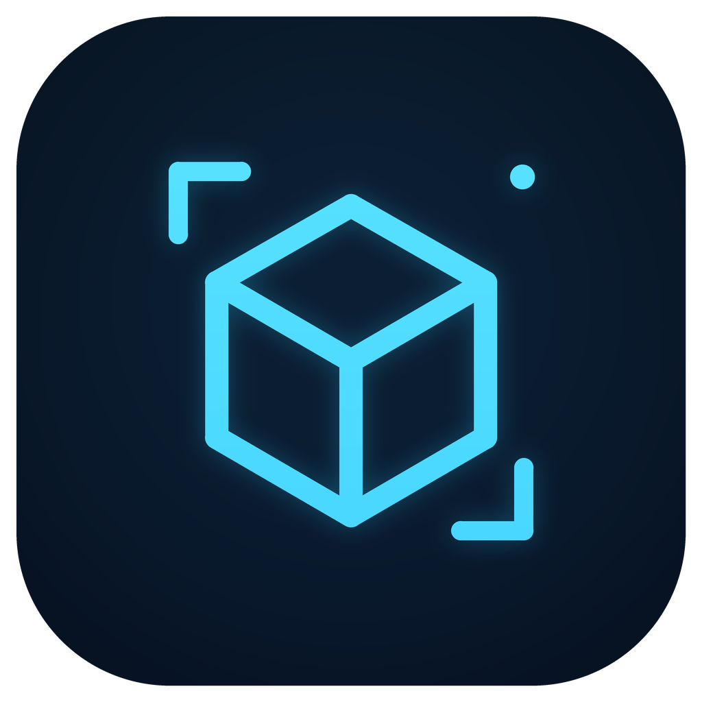

<p align="center">
  
</p>

# CADView Community

CADView Community is an offline, open-source CAD and engineering-document
viewer for Android and iOS. Flutter owns the mobile interface, while a
decoupled Rust workspace handles content-based format detection, parsing,
normalized 2D/3D scenes, spatial queries, measurements, annotations and local
persistence.

The project is licensed under Apache-2.0. Source drawings are always opened
read-only. The Community edition contains the complete available feature set,
has no advertising SDK and requests no network permission.

## Features

- DXF, SVG/SVGZ, OBJ, STL, glTF/GLB and 3MF viewing. DXF includes nested and
  array block references with attributes, dimensions, multileaders, tables,
  ellipses, splines, solids and hatch boundaries; unrendered entity types are
  reported by name.
- Fully offline PDF page rendering, pan and zoom.
- Export the current 2D/3D viewport or loaded PDF page as a PNG, without
  toolbars or navigation controls. Painted annotations are included. Drawings
  with title-block sheets (for example A1/A2/A3 frames) can export each sheet
  as its own PNG and as a PDF with one page per sheet at its paper size.
- DWG R13-R2018+ Beta support with layouts, nested blocks, attributes and a
  validated local reopen cache.
- Bundled OFL fonts provide offline Latin/Greek/Cyrillic, CJK, Arabic, Hebrew,
  Thai, Devanagari, Bengali, Gujarati, Gurmukhi, Tamil, Telugu, Kannada,
  Malayalam, Sinhala, Lao, Khmer, Myanmar, Armenian, Georgian, Ethiopic,
  Tibetan and engineering-symbol fallback in UI, CAD labels and
  annotations. Tests read each font's actual Unicode cmap and check every
  localized UI character and representative CAD text. Mixed-script labels use
  their first strong letter for paragraph direction. Multiline, mirrored and
  rotated text uses shaped layout for viewport culling; Unicode surrogate
  pairs are decoded without dropping supplementary characters. Missing
  proprietary CAD fonts use readable fallbacks, whose metrics and outlines
  may differ from the original font. Texts whose style uses SHX fonts keep
  their CAD proportions: big-font CJK fills the text height and the narrow
  `ebgen.shx` Latin uses a bundled condensed substitute; structural rebar
  codes `%%130`–`%%133` show their grade symbols.
- Black/near-black neutral 2D ink is adapted for visibility on the dark canvas;
  original entity colors, opacity and geometry remain unchanged in the scene.
- 2D pan, zoom, layers, selection, snapping, coordinates, distance with X/Y
  deltas, +X direction, directional Y/X grade, 1:n slope ratio and midpoint
  coordinates, plus drawing-coordinate azimuth (+Y clockwise) and quadrant
  bearing. Direction and grade calculations are scale-invariant for every
  finite non-coincident point pair instead of discarding valid short segments.
  Also includes path length and three-point angle/triangle geometry with all three
  interior angles, all three side lengths, area, perimeter, altitude from the
  selected angle vertex, inradius and circumradius,
  one-tap circle/arc measurement, area/perimeter measurement and text
  annotations. A selected circle reports center, radius, diameter,
  circumference and area; a selected arc reports center, radius, diameter,
  central angle, arc length, chord length, sector area and circular-segment
  area, plus sagitta and start-to-end chord azimuth/bearing in the active
  coordinate reference. Major arcs retain their major sagitta; a full circle
  explicitly reports sagitta and chord direction as undefined.
  A two-tap circle/arc clearance tool reports center distance, both radii,
  1→2 direction and signed supporting-disk edge clearance; negative clearance
  is explicitly labelled as overlap, external tangency is normalized to zero,
  and concentric pairs omit the undefined direction.
  Valid manually picked or entity-based polygon areas expose a numbered
  boundary report for up to 200 vertices. Each directed edge reports from/to
  point, stable length, active-reference azimuth and quadrant bearing. The
  start vertex of every edge also reports its winding-independent interior
  angle, convex-positive deflection and convex/concave/straight classification.
  Copied CSV retains explicit unit/reference metadata; circles do not fabricate
  discrete boundary edges.
  An entity-length takeoff tool totals exact line, polyline, circle and arc
  lengths by tapping entities; tapping an entity again removes it, with
  one-tap undo, clear and copy actions.
  2D and 3D distance midpoints use the active absolute or local coordinate reference and
  are marked directly on the canvas. An axis-aligned rectangle takes two
  snapped opposite corners and reports X/Y width, height, diagonal, center,
  area and perimeter.
  A rotated rectangle takes three snapped points: the first edge sets width,
  while the third point is projected onto its perpendicular to produce a
  strict right-angle height, diagonal, center, area, perimeter and +X
  direction angle.
  A three-point circle reports its center, radius, diameter, circumference and
  area using a large-coordinate-stable circumcircle calculation; duplicate or
  nearly collinear inputs are rejected instead of producing a false huge arc.
  A three-point arc uses start, on-arc and end picks to report center, radius,
  central angle, arc length, chord, sector area, circular-segment area and
  clockwise/counterclockwise direction. It also reports the stable sagitta and
  start-to-end chord azimuth/bearing; the middle pick unambiguously preserves
  minor, major and 0°-crossing arcs, so neither a major segment nor its major
  sagitta is silently replaced by the minor complement.
  For a validated minor arc below 180°, the same one-tap entity result or
  three-point result also derives simple circular-curve tangent length T,
  external distance E, middle ordinate M, tangent-intersection coordinates PI,
  and incoming/outgoing tangent azimuths and bearings. Endpoint radii, directed
  sweep and both tangent constructions must agree; semicircles, major arcs and
  inconsistent imported geometry do not receive fabricated curve parameters.
  A three-point directed baseline measurement reports perpendicular distance,
  left-positive signed offset, station from the baseline start, direction and
  projection-foot coordinates on the explicitly infinite reference line.
  An entity-based station/offset tool selects an existing line, polyline or
  circular arc once and then measures repeated snapped points, reporting
  cumulative, total and remaining station, tangent direction, left-positive
  offset and foot coordinates. Closed loops use their first vertex as the
  station origin. Circular-arc stationing follows the CAD start-to-end
  counterclockwise sweep; its positive-left offset points toward the centre,
  and points beyond a partial arc are clamped to the nearest endpoint.
  The inverse station/offset locator selects the same baseline types, accepts
  station and left-positive offset in the active display unit, then marks and
  centers the exact stakeout point. It rejects out-of-range stations and lets
  the user enter another value without reselecting the baseline.
  A polar stakeout tool snaps one origin and accepts a positive distance plus
  survey azimuth (0° at +Y, clockwise) in the active coordinate reference. It
  marks and centers the target, reports coordinate deltas, and supports
  repeated targets from the same origin without another drawing pick.
  A two-distance location tool snaps reference points A and B, accepts one
  positive distance from each and marks the exact circle-intersection
  candidate points. Two-solution cases are labelled left/right relative to
  A→B, tangency returns one point, and disjoint or contained circles report no
  solution instead of inventing a target. Another distance pair can be entered
  without reselecting the references.
  An equal-division tool selects a line, polyline or circular arc once and marks
  2–200 equal station intervals without drawing misleading shortcut chords
  across corners or arcs. Open baselines include both endpoints; closed loops
  include their station origin once, with total length and exact interval
  reported. The same result opens a scrollable field stakeout table with every
  point's station, active-reference coordinates, tangent azimuth/bearing and
  source element, and copies a unit/reference-explicit CSV. Each row is
  independently reconstructed by station and checked against the displayed
  division point. Open circular arcs below 180° additionally report cumulative
  deflection from the start tangent and the long chord from the curve start;
  polylines, full circles and major arcs do not receive inapplicable curve
  columns.
  A coordinate-collection tool continuously snaps and numbers up to 200
  independent survey points without connecting them. A compact table follows
  the active drawing/local coordinate reference and display unit, and copies
  CSV containing explicit point, X, Y, unit and reference columns. From the
  same table, an open-traverse report lists every consecutive leg with stable
  length, active-reference azimuth and quadrant bearing, plus total route
  length and first-to-last straight distance. Its separate CSV never invents
  a last-to-first closure leg or closure precision without a known endpoint.
  An optional known-endpoint check accepts X/Y in the active unit and
  drawing/local reference, then reports the signed correction vector, linear
  misclosure, correction direction and traverse-length-relative precision for
  either a closed or link traverse. From that verified closure, an explicit
  Bowditch/compass-rule action can distribute coordinate corrections by
  observed leg length and export observed, correction and adjusted X/Y values
  as CSV. The adjustment remains a report and never alters drawing geometry.
  An extended-line intersection tool selects two specific line/polyline edges
  and reports their theoretical intersection, smaller included angle, source
  directions and the exact extension required on each finite edge; parallel
  or numerically ill-conditioned near-parallel picks are rejected.
  A complementary two-tap parallel-line tool selects exact line/polyline
  edges and reports their constant perpendicular spacing plus undirected
  baseline direction. Non-parallel, zero-length and repeated identical edge
  picks are rejected instead of producing a misleading clearance.
  A finite-segment clearance tool uses the same simple two-tap workflow but
  respects both selected edges' real endpoints. It marks the exact closest
  point on each edge, reports their shortest distance and 1→2 azimuth/bearing,
  and returns an explicit zero-distance touch/intersection result instead of
  silently measuring the infinite supporting lines. Collinear overlaps use a
  deterministic first-overlap point along the first selected segment.
  A closed circle yields analytic values and a simple closed polyline yields
  validated area, perimeter and centroid coordinates with one tap; otherwise
  area points retain native endpoint, midpoint and intersection snapping and
  report the centroid of the resulting simple polygon. The centroid is marked
  on the canvas and follows the active absolute or local coordinate reference.
  The same result derives the equal-area circle diameter, hydraulic radius
  `A/P`, hydraulic diameter `4A/P` for a fully wetted section and dimensionless
  compactness `4πA/P²`; inconsistent area/perimeter pairs are rejected rather
  than displaying a shape factor above one.
  A separate closed-area takeoff totals gross and net area plus boundary
  length across multiple circles or validated simple closed polylines using
  tap-to-toggle, undo, clear and copy. Add is the default; one explicit button
  switches subsequent picks to opening deduction, with yellow/red highlights.
  It never infers hole subtraction from winding direction.
  Any positive validated open-path length, accumulated entity length or closed
  boundary perimeter exposes a linear-material quantity action without another
  canvas tool. The user enters usable length per whole unit and optional
  0–100% waste; the result reports adjusted demand, exact and rounded-up whole
  units, procured total length and surplus in the active display unit. It uses
  the same floating-integer normalization, finite checks and one-billion-unit
  cap as area coverage. This is explicitly an aggregate estimator: it assumes
  splicing is allowed and offcuts are fully reusable, and does not claim to
  optimize a per-segment cutting list.
  The same length menu has one plan-slope calculation: it explicitly treats
  the measured 2D length as horizontal run, accepts one non-negative vertical
  difference, and reports the scale-stable hypotenuse, grade, vertical-to-
  horizontal `1:n` ratio and slope angle. A 2D drawing never fabricates an
  uphill/downhill direction. The derived slope length can flow directly into
  the existing linear-material quantity action.
  The engineering-quantity menu can convert any positive validated plan area
  into discrete material coverage. The user enters one whole unit's coverage
  in the active square display unit and an optional 0–100% waste allowance;
  inputs are converted back to drawing units before calculation. The result
  reports adjusted area, exact demand, whole procurement quantity rounded up,
  procured coverage and surplus. Values within floating-point tolerance of an
  exact whole count are normalized before rounding, invalid/non-finite inputs
  are rejected, and procurement is capped at one billion units.
  Any positive validated plan area from a boundary, rectangle, three-point
  circle or positive net takeoff exposes a one-input constant
  thickness/depth calculation. It reports source area, depth and prismatic
  volume in the active cubic display unit without modifying the drawing.
  For earthwork or changing sections, the same menu offers an average-end-area
  calculation: the measured boundary is A1, and one compact dialog accepts A2
  in the active square unit plus the section interval. It reports
  `V = L × (A1 + A2) / 2`, permits a zero daylight end area, rejects negative
  areas or non-positive intervals, and never presents overflow as a result.
  When an independently measured section is available exactly at `L/2`, a
  separate prismoidal action accepts that midpoint area and the other end area,
  then reports the weighted mean and `V = L × (A1 + 4Am + A2) / 6`. The
  midpoint requirement is shown before input; zero sections are valid, negative
  values and non-finite/overflowing results are rejected, and the drawing is
  never modified.
  The same validated boundary perimeter can be multiplied by one positive
  constant height to report lateral wall/formwork area; the result explicitly
  excludes top and bottom faces and retains the active square display unit. A
  direct result action reuses that drawing-area value for material coverage;
  per-unit coverage still follows the active unit and calibration settings.
  Both operations share one compact engineering-quantity action. When source
  units or scale calibration define a physical volume, the volume result can
  also apply an explicit positive density in kg/m³, t/m³ or lb/ft³ and report
  material mass in kilograms, tonnes and pounds. Unitless uncalibrated drawings
  never expose this physical-mass action.
  The same action exposes centroidal section properties for one validated
  circle, rectangle or simple closed polygon: area, centroid, Ix, Iy, Ixy,
  polar moment J, radii of gyration kx/ky, principal moments Imax/Imin and the
  undirected Imax-axis direction. It also reports elastic section modulus
  separately at the +Y/−Y extreme fibers for Sx and +X/−X extreme fibers for
  Sy, so asymmetric sections are not collapsed into one value. Values follow
  the active drawing or rotated local axes; cubic/fourth-power units and scale
  calibration are applied explicitly. A circle, square or other numerically
  isotropic section reports its principal direction as undefined instead of
  inventing an angle. Composite takeoff boundaries are excluded until their
  union and opening topology can be evaluated without guessing.
  Self-intersecting or degenerate boundaries are not reported as valid
  measurements. 3D distance includes X/Y/Z deltas, a numerically stable
  horizontal projection, signed grade percentage, slope ratio, signed slope
  angle and the horizontal projection's azimuth/bearing. Vertical and
  coincident picks explicitly omit directions that are not defined.
- Layer controls support one-tap isolation and one-tap restore-all through a
  single atomic native update, avoiding repeated redraws on large drawings.
- Tap selection opens engineering properties for 2D entities and 3D meshes,
  including exact 2D width/height, 3D X/Y/Z extents, geometric dimensions,
  layer, topology counts and hit coordinates. A selected 2D entity also reports
  exact same-type counts for its layer and the complete drawing, even when a
  large file is rendered as viewport batches. Lines, polylines, circles and
  arcs additionally report same-type total length for the layer and complete
  drawing. Circles and validated simple closed polylines also report
  same-type closed-boundary area; self-intersecting or degenerate boundaries
  are excluded. Measurement results and complete property sheets can be copied
  with one tap for use in field notes.
- Coordinate, measurement and property precision is configurable from 0 to 6
  decimal places and is persisted with the other local UI preferences.
- The app-bar information action opens a compact, copyable engineering overview
  with the full drawing bounds and extents, source/display units, calibration
  state and complete entity/layer or mesh/assembly statistics. These totals do
  not shrink when a large 2D drawing is streamed in viewport batches; document
  compatibility diagnostics remain available in the same panel.
- DXF/DWG `$INSUNITS` is preserved without guessing unitless drawings.
  Measurements and properties can be displayed in common metric or imperial
  units from the existing measurement panel; area conversion uses square units.
- Unitless or incorrectly scaled 2D/3D drawings can be calibrated from two
  snapped drawing points or model-surface points and one known real length.
  Calibration can be reset at any time without modifying the source file.
- A snapped 2D point or picked 3D surface point can be used as a temporary local
  coordinate origin. In 2D, an optional second snapped point defines a rotated
  local +X axis; coordinate readouts, centroids, midpoints and setting-out
  points then use the same right-handed local frame. The canvas marks the
  origin and +X direction. A coordinate-locate action accepts X/Y in the
  current display unit and coordinate reference, marks the inverse-transformed
  drawing point and centers it on screen. Source geometry and lengths remain
  unchanged.
- 3D orbit, pan, zoom, one-tap isometric/front/top/right standard views, mesh
  selection, surface XYZ coordinates, distance/grade and spatial-angle
  measurement with point correction, plus surface-anchored annotations.
  Selecting a mesh reports its validated triangulated surface area in the
  active engineering unit; the overview reports a total only when every mesh
  has a complete, finite indexed result. Mesh selection also validates welded
  edge incidence and winding. It reports enclosed volume only for one finite,
  consistently wound closed manifold shell; open, non-manifold, degenerate or
  multi-shell meshes never receive a guessed volume. The same validity gate
  exposes the volume centroid, which is also the center of mass for uniform
  material density and follows the active absolute/local coordinate reference.
  When the source unit or a
  user calibration defines physical scale, this volume can reuse the explicit
  density action to report material mass. glTF uses its specified metre unit,
  while 3MF preserves its declared unit (millimetres by specification when
  omitted); unitless OBJ/STL data remains unguessed. The tapped triangle additionally
  reports its area, perimeter, three edge lengths, centroid and unit normal
  without scanning the rest of the mesh. The same property sheet reports the
  face inclination from horizontal, finite rise/run grade and winding-neutral
  downslope azimuth; horizontal, vertical and degenerate cases omit directions
  that are not geometrically defined. A two-tap face-angle tool highlights the
  exact picked triangles and reports the smaller 0°–90° plane angle without
  trusting importer winding. When the two planes pass a strict parallel test,
  the same result also reports their perpendicular spacing rather than the
  arbitrary distance between tap positions, with the existing undo, clear and
  copy actions.
- Files can be selected in CADView or opened/shared from file managers, cloud
  drives, mail clients and other apps.
- SQLite annotation persistence, undo/redo and portable `.cadnote.json`
  export.
- Export the current 2D/3D view, including visible annotations, or the current
  PDF page as PNG from the viewer's **More → Export image (PNG)** menu.
  Images exclude toolbars and are saved with the system file dialog; original
  drawings remain unchanged. PNG export is a snapshot of the current view,
  not a full-drawing or multipage PDF conversion.

STEP and IGES remain disabled until the separately reviewed Open CASCADE
adapter is integrated. DWG remains Beta until its licensed compatibility
corpus and visual acceptance gates are complete. See
[format support](docs/FORMAT_SUPPORT.md) and
[architecture](docs/ARCHITECTURE.md) for exact capability boundaries.

## Languages

Every Community build includes English, Simplified Chinese, Traditional
Chinese, Spanish, Japanese, French, Korean and Russian. CADView follows the
system language by default, falls back to English when no language matches,
and allows a manual language selection in Settings.

## Build

Prerequisites: Flutter 3.47+, stable Rust, Android SDK/NDK and Xcode 16+ for
iOS.

```bash
flutter pub get
flutter_rust_bridge_codegen generate
flutter run --flavor community \
  --dart-define=CADVIEW_DISTRIBUTION=community
```

Run the Rust checks:

```bash
cd rust
cargo test --workspace --locked
cargo fmt --all --check
```

Run all repository checks with `scripts/verify.sh`. Android supports API 26+
and iOS supports 15.0+. Release signing material is never stored in this
repository.

An installable Community release APK must be built with all four external
signing variables. The helper refuses missing credentials and verifies the
finished APK before reporting success:

```bash
CADVIEW_ANDROID_KEYSTORE_FILE=/secure/path/community.jks \
CADVIEW_ANDROID_KEYSTORE_PASSWORD=... \
CADVIEW_ANDROID_KEY_ALIAS=... \
CADVIEW_ANDROID_KEY_PASSWORD=... \
bash scripts/build_signed_community_apk.sh
```

An unsigned `flutter build apk --release` artifact is not a distributable APK.

On macOS, `scripts/maintain_ios.sh` maintains the project-local Xcode,
CocoaPods and Rust iOS environment without changing the global Xcode
selection:

```bash
bash scripts/maintain_ios.sh --build community
```

## Repository layout

- `lib/`: Flutter application shell, import flow and viewer UI.
- `rust/crates/cad-core`: format-neutral geometry and scene types.
- `rust/crates/cad-formats`: isolated format adapters.
- `rust/crates/cad-storage`: local SQLite annotation persistence.
- `rust/src/api`: Flutter/Rust application API.
- `rust_builder/`: Cargokit integration for Android and iOS.

## Security and privacy

Format identification is based primarily on file content; extensions are only
a low-confidence hint. Files, paths, hashes and annotations remain on the
device. Community release manifests contain no `INTERNET` permission.

## License

CADView Community is licensed under Apache-2.0. Dependencies retain their own
licenses; see [THIRD_PARTY_NOTICES.md](THIRD_PARTY_NOTICES.md). No GPLv3
component is linked. The acadrust dependency remains MPL-2.0.
